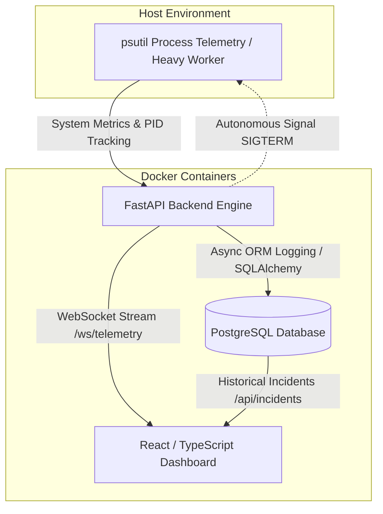

# Autonomous AIOps & Infrastructure Telemetry Monitor

An autonomous SRE observability and remediation engine built with **FastAPI**, **React**, **PostgreSQL**, and **Docker Compose**. The system streams live hardware telemetry over WebSockets, automatically detects resource exhaustion anomalies, autonomously terminates offending processes via host system signals, and logs audit events to PostgreSQL.

---

## 🏗️ Architecture & Data Flow



---

## ✨ Key Features

* **Real-Time Telemetry Streaming:** Sub-second metric streaming (CPU, Memory, Disk) using asynchronous FastAPI WebSocket broadcast handlers.
* **Autonomous Remediation (Self-Healing):** Background SRE monitoring loop that inspects target processes (`heavy_worker.py`) upon breaching configured thresholds (`AUTO_HEAL_THRESHOLD`) and issues OS-level process termination (`SIGTERM`).
* **Persistent SRE Audit Logs:** Incident reports stored asynchronously in PostgreSQL via SQLAlchemy 2.0 and `asyncpg`, surviving container restarts and browser refreshes.
* **Responsive Visualizer Feed:** Custom React dashboard tracking metric trends, real-time alert streams, connection status, and manual remediation overrides.

---

## 🛠️ Tech Stack

* **Backend:** Python 3.11, FastAPI, `psutil`, WebSockets, SQLAlchemy (Async), Pydantic
* **Database:** PostgreSQL 15, `asyncpg`
* **Frontend:** React, TypeScript, Vite
* **Infrastructure:** Docker, Docker Compose (`pid: "host"` namespace sharing)

---

## 🚀 Quickstart & Demo

### Prerequisites
* [Docker Desktop](https://www.docker.com/products/docker-desktop/) installed and running.

### 1. Launch Stack
Clone the repository and spin up services:
```bash
git clone [https://github.com/JacobW2000/aiops-telemetry-monitor.git](https://github.com/JacobW2000/aiops-telemetry-monitor.git)
cd aiops-telemetry-monitor
docker compose up -d
```

Access the services:
* **Frontend Dashboard:** `http://localhost:5173`
* **Backend API Docs:** `http://localhost:8000/docs`

### 2. Test Autonomous Self-Healing Pipeline
Trigger high CPU load by running the stress worker inside the backend container:
```bash
docker compose exec backend python heavy_worker.py
```

1. Open `http://localhost:5173`.
2. Observe CPU load spike past 85%.
3. The autonomous SRE loop will detect the load, issue a process kill command to `heavy_worker.py`, and display a `RESOLVED` incident card in the SRE Feed.
4. Refresh the page (`F5`) to verify the incident history is fetched from PostgreSQL.